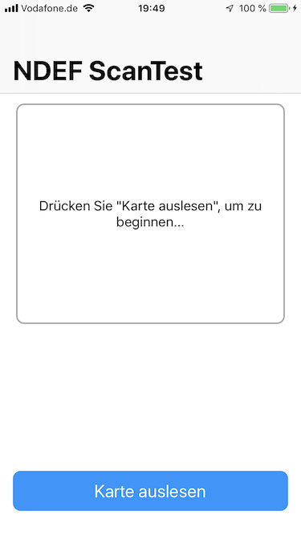
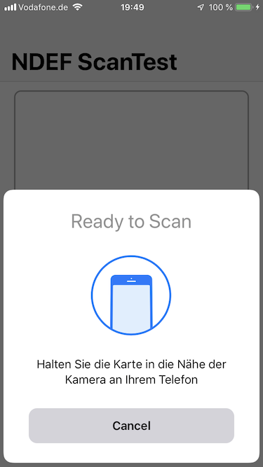
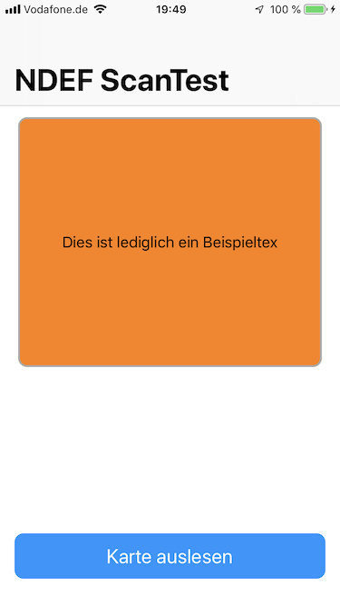
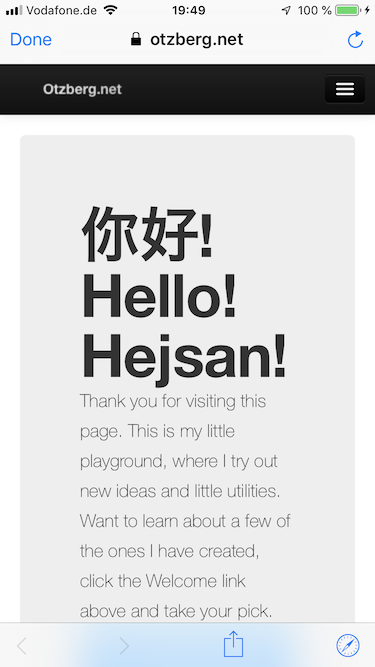

# About this App

This app is merely a pittiful attempt at having a play with CoreNFC and provided a good opportunity to have a play with an Arduino Uno, a PN532 NFC Module and some Mifare Classic 1K RFID Cards / Keyrings

The code got its head start by following a tutorial by Appcode, but was extended with code from Apple Developer Documentation and several other bits.

## ToDo

As a proof of concept it does what it does, however it takes some nasty shortcuts when it comes to detecting URLs (looks for https: or http:) or eMail addresses (looks for an @).

## Language

The app uses labels in German

## Screenshots

# Thanks goes to

Icon: 
Kostenlose Vektorgrafiken von https://de.vecteezy.com

Appcoda:
https://www.appcoda.com/corenfc-introduction/

